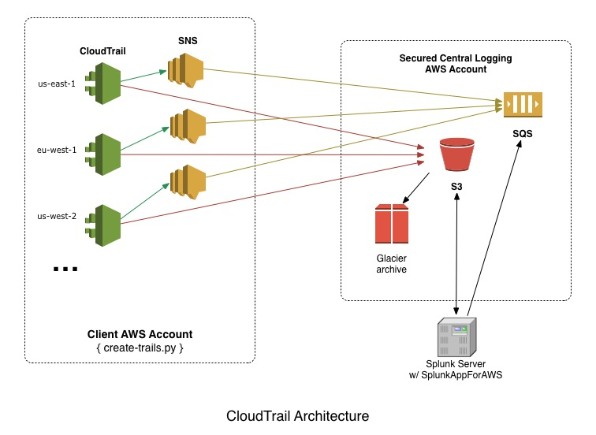

### Create Trails

This Python script will enable CloudTrail in all regions for an AWS account.  Design note: Both the CloudTrail S3 bucket and SQS queue should be located in a seperate secured central account.

It does the following:

1. Creates a new SNS topic.
2. Assigns the appropriate CloudTrail permissions to the new SNS topic.
3. Creates a new trail in each region and enables logging.
4. Subscribes the SNS topic to a SQS queue (for the SplunkAppForAWS app).

**Requirements:**

* Tested w/ python version 2.7 / boto version 2.38
* Valid AWS API keys
* An existing S3 bucket with CloudTrail policy
* An existing SQS queue ARN



**Usage:**

```
  create-trails.py -n <client-name> -k <key> -s <secret>

    -n <client-name> : client or service name
    -k <key>         : aws access key id
    -s <secret>      : aws secret access key
    -h               : print this usage statement

   == Naming convention ==
    * S3 bucket: "<client-name>-central-cloudtrail-logs"
    * SQS queue: "<client-name>-central-cloudtrail-queue"
```

**Output:**

```
./create-trails.py -n test -k XXXX -s XXXX
Creating trail in us-east-1..
Creating trail in ap-northeast-1..
Creating trail in eu-west-1..
Creating trail in ap-southeast-1..
Creating trail in ap-southeast-2..
A trail already exists in the us-west-2 region.
Creating trail in us-west-1..
Creating trail in eu-central-1..
Creating trail in sa-east-1..
```

**To Do:**

- [ ] Create a server side script!
